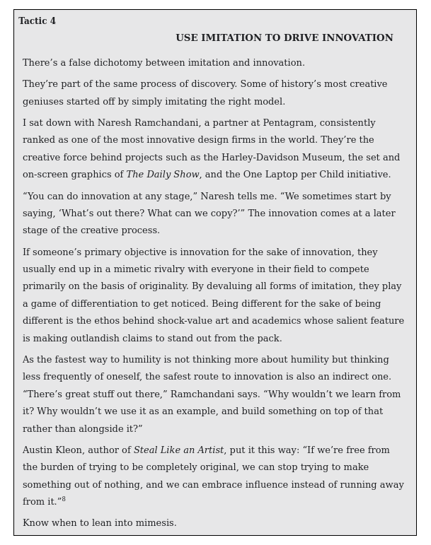
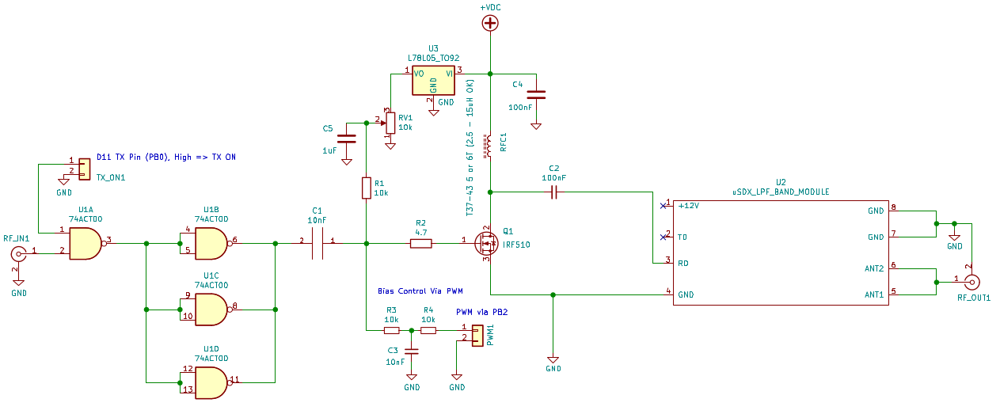
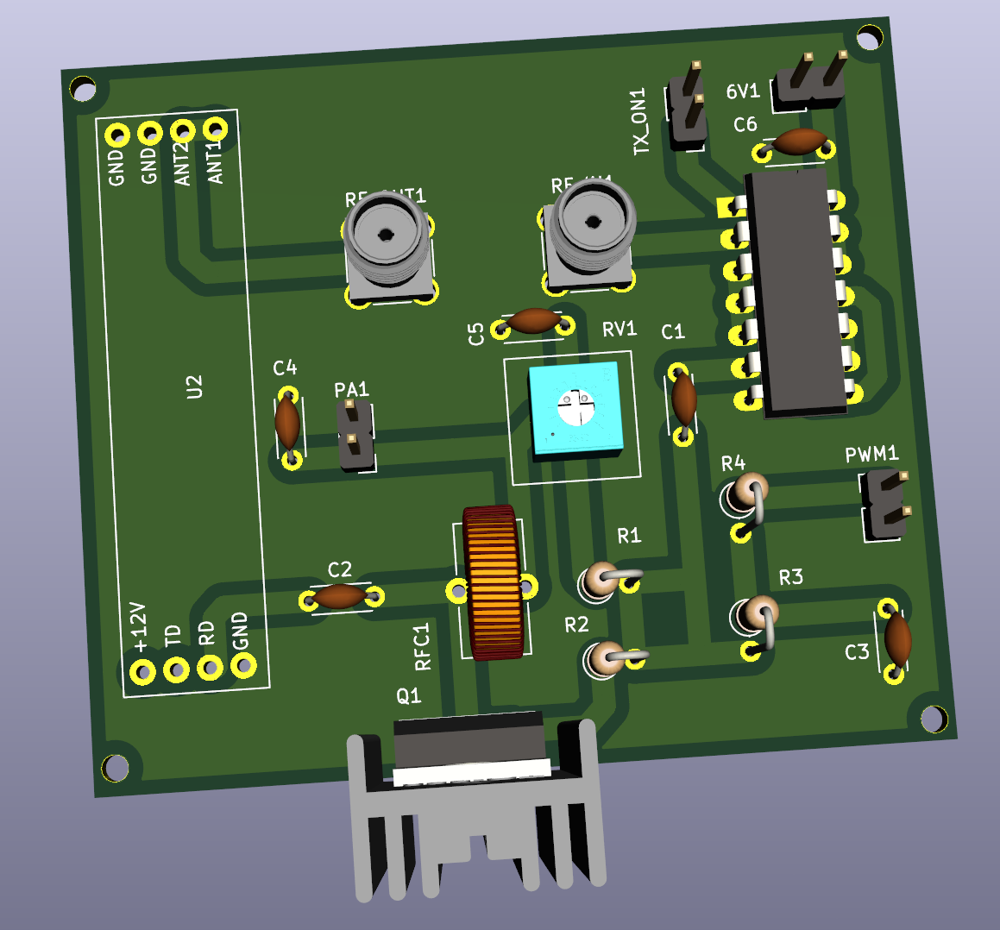
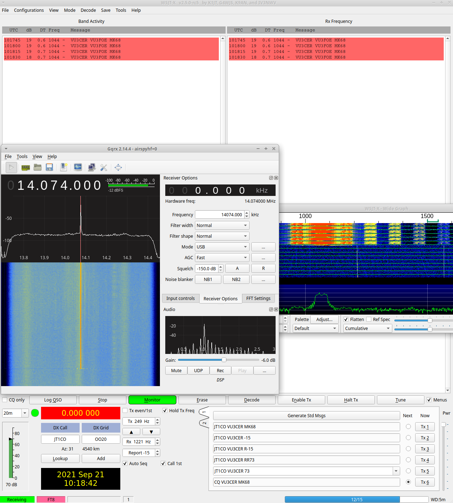
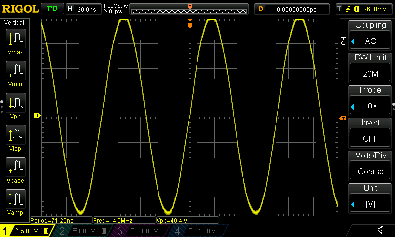
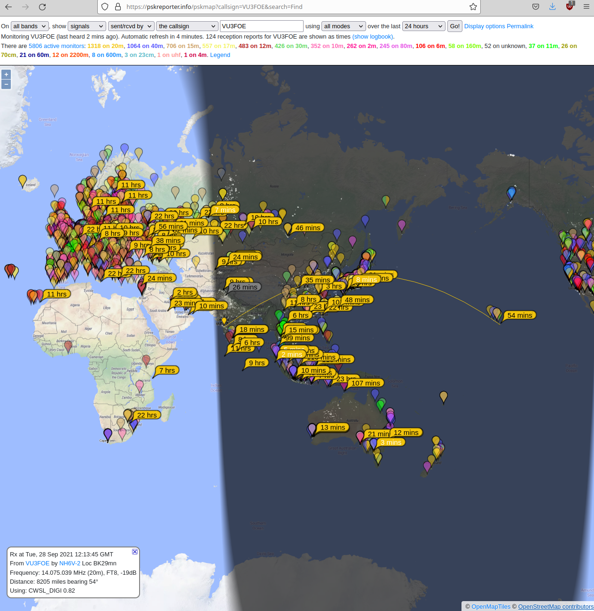
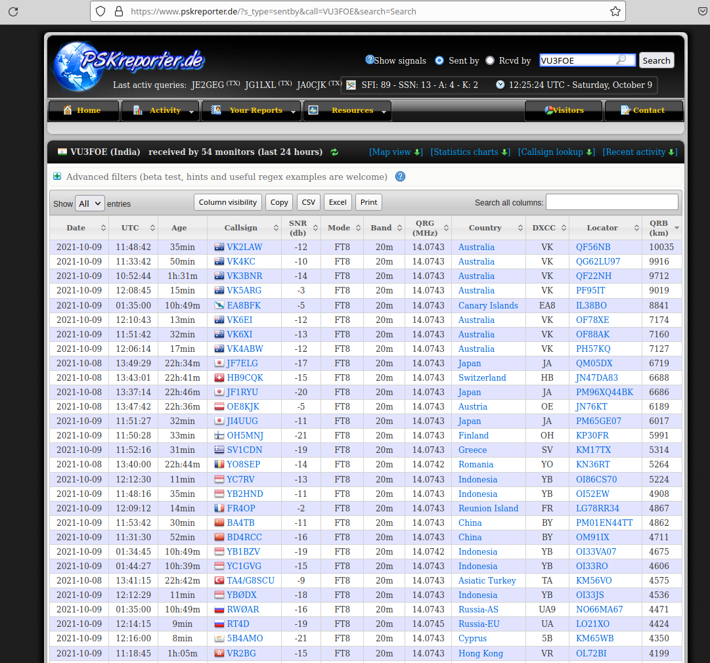
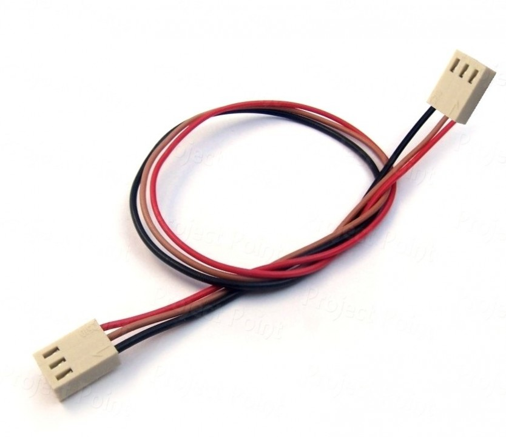
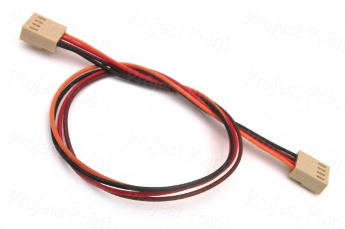

### HF-PA-v3

VU3CER's Robust `Class-C / Class-D HF PA` for https://github.com/kholia/Easy-Digital-Beacons-v1
project for the 20m band.

This design aspires to be the standard mW-to-QRP-Gallon HF PA in the ~600 INR
(8 USD) design space.

Design Constraints:

- PCB is to be homebrewed.

- PCB is single-sided - only one layer (side) is available for routing.

- IRF510 MOSFET needs to be on an edge to allow usage of heatsinks.

- Typical external linears (e.g. `PA150 HF Linear Amp`) need 2W minimum to
  function. So we need a minimum of 2W of RF output from our design.

- Minimal part count is strongly preferred. Low cost, and ease of availability
  are strong driving and deciding factors.

  The cost of this HF-PA-v3 system is less than one RD16HHF1 MOSFET ;)

- Reproducibility is a MUST! We focus a lot on this aspect by documenting each,
  and every detail possible.

- Repairability in the field is a MUST!

  Dhiru's finding: Repairing homebrewed PCBs is so much easier, and fun than
  reworking commercial `lead-free` PTH PCBs.

- No moving mechanical parts are allowed in the design - this rules out usage
  of (failure-prone) active cooling options like fans.

Input: Few milliwatts is fine. Note: Si5351's output is around 8-10mW.

Output: 5W+ @ 28v for the 20m band (`QRP Gallon achieved!`) with around ~42%
efficiency. 4.25W+ @ 24v for 20m band (14 MHz) using a single IRF510 with ~33%
to ~43% efficiency. Solid 3W+ at 19v with less than 500mA of total current
consumption. Solid 4W+ at 22v with less than 500mA of total current
consumption. More output is possible via a bit more gate biasing voltage +
increased PA voltages (>= 29v). The `Easy-Digital-Beacons-v1` system itself
consumes 2.49W when operating in the `Beacon Mode`. In comparison to this `v3
HF PA`, https://github.com/kholia/HF-PA-v2/ is more efficient (@ 14 MHz) but is
not as robust. In comparison, ICOM IC-705 efficiency is around 24% - It
consumes around 1.5A @ 13.8v to output 5 watts - Of course, ICOM's PA is a
linear one (with known low efficiencies) whereas ours is a switching one.

Robustness check: The PA works fine with 100% duty cycle for more than 8 hours!
In real-life, WSPR defaults to using ~2-minute TX intervals every 10 minutes.
FT8 is naturally gapped every ~15 seconds, and so on. We have also run FT8 on
this HF PA for more than a day at a time. The whole `HF PA v3` system is
thermally super stable.

Note 1: The output power is software controllable (via `PWM grounding`) for
flexibility.

Note 2: The idea behind making these (and my other) design notes publicly
available is to deliver REPRODUCIBLE, flexible, home-brewable, standardized,
reasonable, and cost-effective solutions for some common problems. I include
many references, simulations, and notes in my projects to enable you to do your
own (better) designs - do share them ;)

(Image Credit: `Wanting` book by Luke Burgis)

Note 3: All screenshots are clickable and zoomable.

Note 4: Use the `HF-PA-v3-No-Regulator` PCB version included in this
repository. This version doesn't need the 7805 linear regulator.

Please see the older https://github.com/kholia/HF-PA-v2 project for the
power-supply (over-current protected), and LPF designs.

(26-September-2021 UPDATE): [A multi-band (40-20-17-15) version of this PA is now available](https://github.com/kholia/HF-PA-v4/)!

Schematic:

PCB renderings:

Pics (or it didn't happen):

This HF PA is capable of winning some nice awards (e.g. `QRP-ARCI 1000 Mile per Watt award`).

The HF PA is connected to a 20m dipole over 55 meters of HLF-200 coax.

#### PA tuning process

- Remove the MOSFET from the TO-220 socket.

- Set gate bias to 3v. This ensures that IRF510 isn't turned ON - double-check
  this by monitoring the power consumption.

- Connect the MOSFET back, and measure RF output. Happy with the output power? -
  If yes, you are done else follow the next steps.

- Remove the MOSFET, increase the gate bias voltage in very small increments
  (0.1v types).

- Connect the MOSFET back, and measure power consumption without any RF input.
  Ensure that MOSFET remains OFF without any RF input.

- Apply RF input, and measure RF output.

- Repeat these steps as needed.

The [QRP Labs' procedure for bias adjustment](https://www.qrp-labs.com/images/pa/pa_simple_assembly_A4.pdf)
seems to be better.

#### PA BOM

- 1 x SN74ACT00N (TI) - 65 INR

- 1 x IRF510 (Genuine Vishay parts are tried-and-tested) - 35 to 50 INR

  - The `SEC` (`SEC Electronics Inc`) branded IRF510(s) also work great!

  - The `SEC IRF510` performs even better than Vishay's version. This
    particular result will vary between different product batches.

  - IRF510 with `International Rectifier` branding are most likely fake or "new
    old stock" if you are very lucky!

    Note: IR and Infineon have stopped manufacturing IRF510 MOSFETs.

  - AliExpress IRF510(s) are likely to be fake

  - The IR IRF510 gave ~3W versus 5.2W+ from SEC IRF510 versus ~5W from
    Vishay's IRF510!

    Note: The gate threshold voltage can vary even between two samples picked
    from the same manufacturer!

  - The Cgs ("gate capacitance") of a fake IRF510 is typically more than 1000pF
    on a LCR-T4 meter. This value is around ~400pF for genuine IRF510 parts on
    a LCR-T4 meter.

  - Ensure proper sourcing (trusted supply chain, etc) to get genuine parts

- 10K Preset (Potentiometer) Bourns-3386P - 15 to 20 INR

- 4 x 10k Ohm - 0.25W Metal Film Resistor - 10 INR

- 1 x 4.7 Ohm Resistor - 5 INR

- A very large heat sink - 50 to 200 INR - larger heatsink is better!

- 1 x 7805 (TO-220 package from CDIL / ST) Voltage Regulator (Optional but makes PA voltage experiments easier) - 10 INR

- MT3608 2A Max DC-DC Step Up Power Module (Robu) - 60 INR

- 2 x SMA connectors (PCB mount) - 75 INR

- 5 x 100nF (104) Ceramic Capacitor - 15 INR

- 1 x 10nF (103) Ceramic Capacitor - 5 INR

- 1 x uF (105) Ceramic Capacitor - 5 INR

- 1 x FT37-43 (Black Toroid) - 50 INR

  - With 5T of 22 SWG wire, I see 25uH of inductance on my LCR-T4 meter

  - This 5T idea was also found (later) in the NB6M's Miniboots design!

- Misc: Relimate Connectors, Copper Clad PCB, Various Consumables (~100 INR)

- Tools: LCR-T4 Meter (for measuring things), RF Power Meter

- Optional power supply: LM50-20B24 Mornsun SMPS - 24V 2.2A - 52.8W AC/DC SMPS - 700 INR

- PA Total Cost: ~600 INR

#### LPF BOM

- 3 x T37-6 - Yellow Toroid, 1 x T37-2 - Red Toroid (LPF)

- 2 x 180pf, 2 x 390pf, 1 x 30pF NP0 Ceramic Capacitors (LPF caps, Kemet / Vishay / Multicomp Pro)

  Note: The `C0G (NP0)` property is important for filters. Don't doubt this ;)

  Note 2: Get >= 100v rated caps - we are going to output more power!

- 3 meters - Copper Magnetic Winding Wire (22 SWG, ~0.7mm) - 25 INR

- LPF PCB or roll your own

Note: LPF design and values are borrowed from GQRP technical pages (W3NQN), QCX
manual, and uSDX WB2CBA PCB documentation.

#### Power Supply BOM

See https://github.com/kholia/HF-PA-v2.

#### BOM + Equipment Sources

- https://www.semikart.com/ (IRF510, NP0 LPF caps - Kemet and others)

  - Multicomp Pro 100v C0G caps from Element14 are recommended

- https://www.semikart.com/search/SN74ACT00N

- https://www.electronicscomp.com/

  - IRF510 (Vishay), regular caps, ST voltage regulators

- https://www.onlinetps.com/shop/ (IR IRF510, new old stock perhaps?)

- https://www.electroncomponents.com/ (transistors, connectors, consumables, misc)

- https://www.sunrom.com/ (regular ceramic caps, SMA connectors)

- https://projectpoint.in/

  - Transistors, regular caps, voltage regulators, pots / trimmers, MFR resistors, misc

  - 2-Pin High Quality Relimate Connectors (all those 2-pin headers are actually Relimate Connectors)

  - Copper Magnetic Winding Wire

  - 3-Pin Relimate Cable Female to Female (High Quality 2500mA) - 'TO-220 socket'

- Semikart, eBay (`gr_makis`) - Toroids

- https://www.ktron.in/ (SMA connectors)

- [LCR-T4 LCR Meter](https://www.techtonics.in/lcr-t4-12864-lcd-graphical-transistor-tester-resistance-capacitance-esr-scr-meter)

- [AVOID] https://www.fabtolab.com/78l05-voltage-regulator (https://www.ventor.co.in also works)

- https://robu.in/ (voltage boost module)

Note for international buyers: The BOM can be carefully sourced via Mouser and DigiKey.

#### O(Current consumption)

The ESP8266 usually draws a peak current of about 250mA after it wakes up and
then more or less constantly draws around 70mA before it goes back to sleep.

DS3231 -> 5mA

Si5351 -> ~50 to 100mA

PA -> Less than 1 A (rms)

Upper bound -> 1.4A maximum.

#### Tips

MOSFETs are sensitive with regards to ESD and high soldering temperatures. Use
best practices when dealing with MOSFETs and perhaps always ;)

By using these `TO-220 Sockets`, we can easily support any MOSFET pinout. This
technique allows usage of `off-pcb` heat sinks with a lot of flexibility. It
also avoids common ESD + MOSFET problems as well. The gate bias can be easily
checked by safely removing the MOSFET from the TO-220 socket. Also, this socket
idea allows us to safely eliminate the LDO from the design.

`SN74ACT00N` can be driven at 6v - this is the secret LU2HES sauce! RF input
drive strength matters the most.

Note: Juan (WJ6C, uSDXn project) reports that IRF530 works better (produces
more power) than IRF510 at higher voltages like 19.5v or 24v. Dhiru's finding
IRF510 works better at 19v (3.25-Watt VS 3-Watt for IRF530). And it should,
right (with its less gate capacitance)?

A burnt 78(L)05 regulator can easily eat up 4-5W of power by itself. If there
is no RF output but power is being consumed then check your linear regulator.

#### Ideas (for v4)

- Be a bit bold, and try Class-D biasing (IRF510 operates in saturation in
  Class-D)!

  Update: Done in https://github.com/kholia/HF-PA-v4 design.

- Try adding a 2N2222 driver stage for output boost to 10W (idea from VU2ASH).

  Update: Done in https://github.com/kholia/HF-PA-v4 design.

- Add support for 15m band. Is this even possible? Keep all leads short (no
  more TO-220 socket idea then it seems).

  Update: Done in https://github.com/kholia/HF-PA-v4 design.

#### References

See [References.md](./References.md).

#### Credits

This design uses ideas from NA5N, Sandeep VU3SXT, PY2OHH, NB6M, LU2HES, Hans
Summers, and VU2ESE (Farhan).

Also see https://github.com/kholia/HF-PA-v2#credits.
